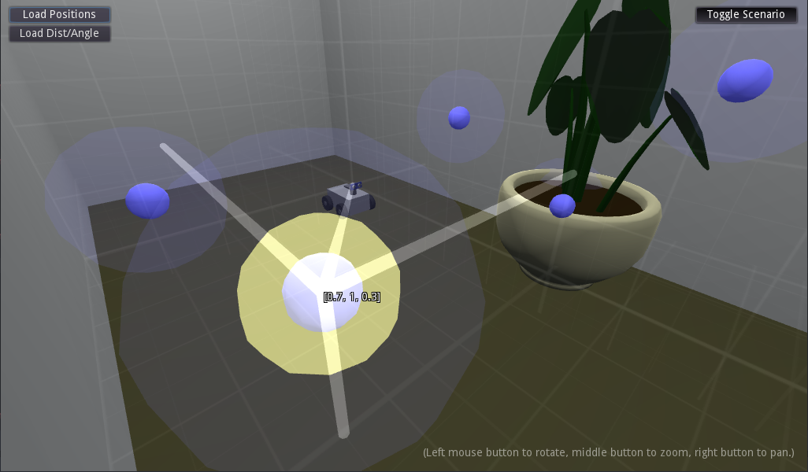

# MarkerViewer3D

MarkerViewer3D is an app to visually inspect 3D positions in either cartesian (X,Y,Z) or circular (radius, angle) CSV data files. 

Circular coordinates are relevant when debugging data from ultrasonic ranging sensors in rover robots, as the sensors are usually in fixed position (respective to robot) but rotated around with a servo


Position data files have 3 columns for axes X, Y and Z (where Y is forward and Z is up). "Dist/angle" (distance, angle) data files have 2 columns for distance and angle, where angles are in degrees and 0.0 means straight forward.

The app was made using Godot Engine 3.4.

----

Files are loaded from their corresponding buttons for position or dist/angle, and can have any extension as long as the content is pure-text CSV (comma-separated values).

A position file looks like:

```
-0.4,1.2,0.5
0.8,0.2,0.2
0.7,1.0,0.3
```

A dist/angle file looks like:

```
0.75,-20
0.75,-10
2.95,0
2.25,10.0
2.23,15.3
```


Hovering the mouse over a data point will highlight it and show the underlying data values.


Clicking a data point will move the camera to it, as well as drawing helper lines for X, Y and Z axes and a direct line from origin (robot sensor) to the point.


In the case of circular data, the vertical (height) coordinate is not known, and while it is assumed to be zero (same height as robot sensor), ground inclination can cause oscillations in height of measured point. Therefore, along with the marker point, an arc is drawn representing the different height points sharing the same distance.


A subtle grid is presented, and clicking a data point will show lines parallel to major axes, from the point to the corresponding grid plane. Data values are only shown next to the point to avoid visual pollution.




Scenario 3D models can be shown for visual aid. They can be designed in blender ([blender.org](https://blender.org)) and exported to glTF binary format (`glTF Binary (.glb)`). Not all blender features are supported - for now, only meshes, Principled BSDF-only materials and point lights are tested (light intensities and ranges won't match blender ones exactly and are limited to 8 per surface).

To use scenario models, place the `.glb` files in the `scenario` subfolder. You can have as many files as you want, and they will all be loaded and overlayed.

You can hide and show the scenario at any time using the `Toggle Scenario` button, leaving a black background.


